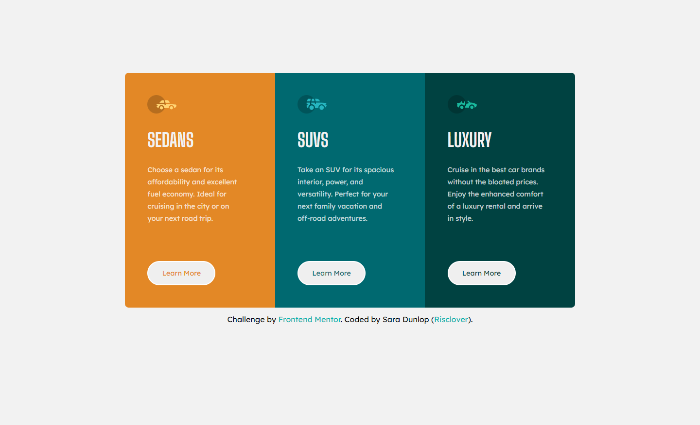

# Frontend Mentor - 3-column preview card component solution

This is a solution to the [3-column preview card component challenge on Frontend Mentor](https://www.frontendmentor.io/challenges/3column-preview-card-component-pH92eAR2-). Frontend Mentor challenges help you improve your coding skills by building realistic projects. 

## Table of contents

- [Overview](#overview)
  - [The challenge](#the-challenge)
  - [Screenshot](#screenshot)
  - [Links](#links)
- [My process](#my-process)
  - [Built with](#built-with)
  - [What I learned](#what-i-learned)
  - [Continued development](#continued-development)
- [Author](#author)

## Overview

### The challenge

Users should be able to:

- View the optimal layout depending on their device's screen size
- See hover states for interactive elements

### Screenshot

#### Desktop


#### Mobile


### Links

- [Go to solution](https://your-solution-url.com)
- [Go to live site](https://risclover.github.io/3-Column_Preview_Card/)

## My process

### Built with

- Semantic HTML5 markup
- CSS custom properties
- Flexbox

### What I learned

Another successful project. I'm banging these basic projects out within a day at this point, and that makes me feel pretty good. Am I using "best practice" code? Hopefully. Do I know everything? No way. I'm extremely comfortable with building fairly simple responsive pages, but I still have plenty to learn and a long way to go!

This was my first project using 3 different "breakpoint layouts" (my main layout plus 2 media queries), and rather than using vw as my unit, I used % a lot more. I've seen several comments (on various projects and such) saying that you should start with the mobile layout first and adapt to the desktop layout rather than starting with the desktop layout, and somebody left a comment on my last solution mentioning that I should try it, so that's what I did. I don't know if it's because I'm gaining more experience and confidence or if it actually madea big difference, but this project was much easier than the previous one in terms of going from one to the other!

So easy, in fact, that, as I mentioned a few sentences ago, I was comfortable with doing 3 layouts for the first time. After building my general mobile and desktop layouts, I didn't like the transition between mobile and desktop. There was a chunk in the middle of the resolution range where it looked odd, whether applied to the mobile layout or the desktop layout. I've read a few articles with tips on building responsive websites, and they all mention that you should generally do 3 breakpoints (at certain resolution points), so that helped convince me, too. To be completely transparent, my middle layout wasn't anything special; I pretty much allowed the layout to stop "growing" as the screen "grew", and kept it one size for a short period of resolution range, if that makes sense. (Go and see for yourself with browser devtools!)

One more thing! I think in my last project I mentioned starting to comment my code more. I did it again, and this time I even made sure that my CSS was organized, which I've never ever done! 

```css

/* General */

body, html { ... }


/* Containers */

#main { ... } /* Container containing everything else (for Flexbox purposes) */
.container { ... } /* general rules for all 3 containers */
#sedan { ... } /* Individual ID/selector for each content container (background colors and, when       needed, border-radius */
#suv { ... } 
#luxury { ... }


/* Text */

h1 { ... }
p { ... }


/* Images */

img { ... }


/* Buttons */

button { ... } /* General styles for all buttons */
#sedan-button { ... }         /* Each button has an ID... */
#sedan-button:hover { ... }   /* ...and a selector for its hover state */
#suv-button { ... }
#suv-button:hover { ... }
#luxury-button { ... }
#luxury-button:hover { ... }


/* Footer/Credits */

.attribution { ... } /* Some styling rules for the small text and links beneath the project */


```

### Continued development

Although I'm loving these HTML and CSS projects, I'm very serious about trying to get a career in programming/software development/web development (I'm not sure yet), so I'm still focused on learning JavaScript. 

...ugh. :(

## Author

- Website - [Gaming with Risclover](https://gamingwithrisclover.wixsite.com/home/)
- Frontend Mentor - [@Risclover](https://www.frontendmentor.io/profile/Risclover)